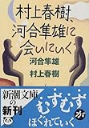
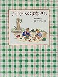
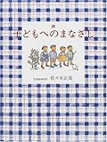

人生28年、結婚3年、父親2年程度のひよっこですが、自分への再確認と友人へのアドバイスをこめて、普段心がけていることを。

1. 自分が生きている意味、目的は家庭にある
2. 良いも悪いもひっくるめて全て丸ごと受け入れる
3. あきらめる、妥協する、ぼちぼちがんばる

#### 自分が生きている意味、目的は家庭にある

私は自分が生きている意味、目的は家庭にあると思っています。親に生んでもらい、育ててもらいました。自分が家庭を持ち、子供を育て、次の世代に命のバトンをつないでいくことにこそ意味があると思っています。人並みに勉強もしたし、塾にも通ったし、大学にも行きました。就職して仕事もしています。自分の市場価値を継続して上昇させるために勉強もしています。それはお金持ちになるためでも、名声を得るためでもなくて、家庭を、家族を守るためです。

だから、自分の判断基準、価値基準は全て「家庭を大事にするためにはどうしたら良いか」というところに置かれています。毎日早く帰りますし、子供とは精一杯遊びます。自分の考えを表明して会社での仕事内容も自分のスタイルを維持できるようにしています。家族といる時間には自分の勉強はしません。時には仕事を優先させることもあります、でもそれはそうすることが長い目で見て家庭のためになると考えるときです。

自分にとって、勉強すること、仕事をすることは手段であって目的ではありません。家庭のためならいつでも仕事をやめる覚悟があります。だからこそ、仕事もがんばれますし、がんばらなくてはいけません。

#### 良いも悪いもひっくるめて全て丸ごと受け入れる

夫婦は結婚するまで何十年も赤の他人として生活してきました。子供はまったく別の人格として存在しています。はっきり言って同じ家庭で生活をしている家族であったとしても、うまくいくはずが無いと思っています。常識も違えば、考え方も違います。性別も違えば、脳の構造も違います。気に食わないこともあります。どうしても理解できないこともあります。どうしても許せないこともあります。

でも、全てをひっくるめて1人の人間です。良いところも悪いところも理解できるところも理解できないところもある、それで当たり前です。その全てをひっくるめて受容する。そのままのあなたでいいんだと認め合う。それが家族だと思います。親は子供に対してそれを伝える必要がありますし、夫婦は人生をかけてお互いを認め合うということに対して努力しあう。結婚して家庭を持つ、子供を持つということはまさにそのためのことだと思います。

#### あきらめる、妥協する、ぼちぼちがんばる

・・・・・・と、ここまで理想論的なことを書いていると思われると思います。「そんなの無理だ」と思われる方もいると思います。で、実際無理です(笑)。実際には自分で自分のコントロールができずにイライラしたり怒ってしまったりすることもよくあります。でも、まぁ、しょうがないですよ。自分に対しても相手に対しても「あきらめ」「妥協」することが必要だと思います。

「あきらめ」「妥協」という言葉は非常にネガティブに捕らえられることが多いと思いますが、私はそんなことは無いと思います。きちんとできないことをできないと受け止めて、その上でどうしようか、というように考え出すことができるからです。完全に理想を追い求めても心が苦しくなります、逃げ出したくなってしまいます。適度に「あきらめ」「妥協」してその上で前に向かって歩いていけることが大事なのではと思います。なんといっても、家族というのは一生ものです。時間はたっぷりとあります。のんびりいこうじゃありませんか。

#### 具体的にどうしているのか

これらのことを心がけながら具体的に以下のようなことを行動としてしています(しようとしています)。

- 毎日できるだけ早く帰る。
- 家に帰ったらその日あったことを聞く。共感する。(共感するよう努める)
- 家では極力仕事をしない。仕事のことを極力考えない。
- 子供とは思いっきり遊ぶ。帰ってきたばかりで暑くてもお腹がすいていてもとにかくひとまず遊ぶ。
- 些細なことでも感謝する。それを伝える。
- 喧嘩になったら自分から謝る。
- 自分がまったく悪くないと思うことでも、自分から謝る。相手にとっての真実はきちんと認める。
- 怒らない。
- 否定しない。

#### 読んでおくと良い本

[  
話を聞かない男、地図が読めない女―男脳・女脳が「謎」を解く アラン ピーズ バーバラ ピーズ](http://www.amazon.co.jp/exec/obidos/ASIN/4072352179/ebiswebpag-22/ref=nosim)

この本に書かれていることには「なるほど、確かに」とうならされます。知っておくのと知らないのとでは受け入れ方がかなり異なると思うので、結婚する前にぜひ読んでおくべきだと思います。

[  
村上春樹、河合隼雄に会いにいく (新潮文庫) 河合 隼雄 村上 春樹](http://www.amazon.co.jp/exec/obidos/ASIN/4101001456/ebiswebpag-22/ref=nosim)

本の中の一部に結婚や夫婦生活について話されている部分があります。結婚する前は「そんなものかな。」程度にしか思いませんでしたが、結婚した今となっては深くうなづくようになりました。

[  
子どもへのまなざし 佐々木 正美](http://www.amazon.co.jp/exec/obidos/ASIN/4834014738/ebiswebpag-22/ref=nosim)

[  
続 子どもへのまなざし 佐々木 正美](http://www.amazon.co.jp/exec/obidos/ASIN/483401732X/ebiswebpag-22/ref=nosim)

育児に関してはこの本に書かれていることが一番心に響き、「こういう育児をしたい」と思いました。もっと言うと、自分としてはもっと嫁を大事にしなくてはと思いました。夫婦で読んでおくと良いのではないかと思います。

#### 余談

嫁には「言ってる割にはできてない」と厳しい言葉をいつもいただいております。嫁の実家の部屋には「不言実行」とかかれてました。「有言中途半端」よりは「不言それなり」の方がいいのかもしれません。そこは悩みどころです。
