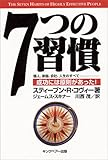
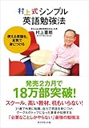
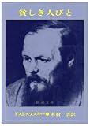

見送りに行った帰りに、久しぶりに本屋に寄りました。嫁と娘がいない間に料理の腕を磨こうと考えていて(何をしていてほしい?と聞いたらそういう回答だったので)、そのための本を探しにいったはずだったのだけれども、ふらっとビジネス書のあたりをみたら面白そうな本が沢山ありすぎて衝動買い。前から読みたかった本もあるけれど。

[  
7つの習慣―成功には原則があった! スティーブン・R. コヴィー ジェームス スキナー](http://www.amazon.co.jp/exec/obidos/ASIN/4906638015/ebiswebpag-22/ref=nosim)

[  
村上式シンプル英語勉強法―使える英語を、本気で身につける 村上 憲郎](http://www.amazon.co.jp/exec/obidos/ASIN/447800580X/ebiswebpag-22/ref=nosim)

[  
こうすれば必ず人は動く デール・カーネギー](http://www.amazon.co.jp/exec/obidos/ASIN/4877712402/ebiswebpag-22/ref=nosim)

[  
貧しき人びと (新潮文庫) 木村 浩 ドストエフスキー](http://www.amazon.co.jp/exec/obidos/ASIN/4102010068/ebiswebpag-22/ref=nosim)

うーん。本屋さんは面白すぎるな。なまじ今なら好きな本が好きなだけ買えるからむしろ危険かもしれない(笑。
