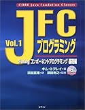
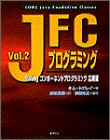
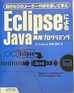
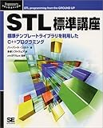
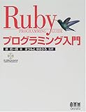
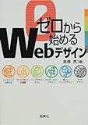
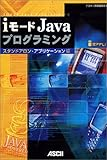
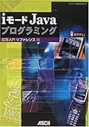
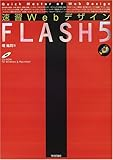

会社に置きっぱなしになっていた本で、いらないものを整理、処分。こうしてみてみると、自分の過去が透けて見えるようです…。

(注意：私の仕事はWindowsインフラ系エンジニア)

[  
JFCプログラミング〈Vol.1〉Swingコンポーネントプログラミング 基礎編 (Java books) 浜田 光之 キム トプレイ](http://www.amazon.co.jp/exec/obidos/ASIN/4894711346/cagylogic-22/ref=nosim)

[  
JFCプログラミング〈Vol.2〉Swingコンポーネントプログラミング応用編 (Java books) 浜田 光之 キム トプレイ](http://www.amazon.co.jp/exec/obidos/ASIN/4894711818/cagylogic-22/ref=nosim)

[  
EclipseによるJava実用プログラミング―自分だけのメーラー作成を通して学ぶ 神尾 貴啓](http://www.amazon.co.jp/exec/obidos/ASIN/4898145582/cagylogic-22/ref=nosim)

- Direct3D プログラミングガイドブック(amazonで引っかからなかった)

[  
STL標準講座―標準テンプレートライブラリを利用したC++プログラミング (Programmer’s SELECTION) エピステーメー ハーバート シルト](http://www.amazon.co.jp/exec/obidos/ASIN/4881357786/cagylogic-22/ref=nosim)

[  
Visual C++〈2〉はじめてのオブジェクト指向プログラミング (プログラミング学習シリーズ) 山本 信雄](http://www.amazon.co.jp/exec/obidos/ASIN/4881358227/cagylogic-22/ref=nosim)

- <3>もあります。<1>はどこかに行っちゃいました・・。

[  
クラッキング対策ファイナルガイド―難攻不落のネットワーク構築 Anonymous](http://www.amazon.co.jp/exec/obidos/ASIN/4881357328/cagylogic-22/ref=nosim)

[  
Rubyプログラミング入門 まつもと ゆきひろ 原 信一郎](http://www.amazon.co.jp/exec/obidos/ASIN/4274063852/cagylogic-22/ref=nosim)

[  
ゼロから始めるWebデザイン 高橋 晃](http://www.amazon.co.jp/exec/obidos/ASIN/4791610946/cagylogic-22/ref=nosim)

[  
iモードJavaプログラミング - スタンドアロン・アプリケーション編 (Ascii books)](http://www.amazon.co.jp/exec/obidos/ASIN/475613727X/cagylogic-22/ref=nosim)

[  
iモードJavaプログラミング 拡張APIリファレンス編 (Ascii books)](http://www.amazon.co.jp/exec/obidos/ASIN/4756138039/cagylogic-22/ref=nosim)

[  
速習Webデザイン FLASH5 境 祐司](http://www.amazon.co.jp/exec/obidos/ASIN/4774111449/cagylogic-22/ref=nosim)
