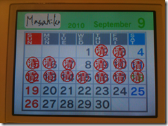
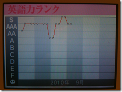
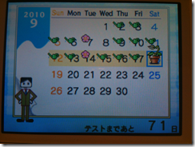
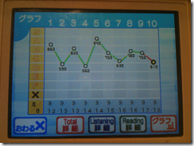
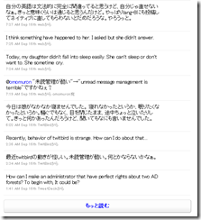

### ココネ

ココネは今週もココネスカイタワーのダイア取得にいそしんでおります。結構ダイヤの数が増えてきて、先週の65個から115個に増えました。

STEALTHCATは全部ダイヤ、ファクトリースクランブルも 48階までダイヤにしました。あと半分弱ですね。ファクトリースクランブルはダイヤを取ろうと思って再度挑戦すると「あれ、こんなの俺できなかったの?」という感じがあり、少しは力がついてきている気がします。

スイカパニックをやっていないので、単語パワーは変わらず。スイカパニックが一番難しいと思うので、後回しにしてます(笑)。

相変わらずお昼休みに続けてます。

### smart.fm

smart.fmはあまり手付かず!ちょっと時間の割り当てを考えないと、やらずにずるずるいってしまいそうです。ココネと取り組む曜日を決めてしまおうかな・・・、と、考え中。それでも、一応マスターが3160から3203に増えました。

### Smart.fm - iPhone

 

smart.fmのiPhone学習アプリの「TOEIC 800点を狙え!」は一通りすべてのアイテムに目を通しました。とはいえこのアプリはまずただ単に眺めるだけで学習したことになるので、これからテストをしていきます。このレベルの単語は私にはまだ難しくてあまり頭に入ってない気がするので続けていきたいなと思います。

 [TOEIC 800点を狙え！- Smart.fm](http://click.linksynergy.com/fs-bin/click?id=bCuRGpr1MYc&offerid=94348.4357032934&type=2&subid=0)

### 英語漬け

   

今週も毎日やりました。英語漬け。英語力ランクはやっと2回ほどSを取れましたが、またAAAに逆戻り。それでも、ちょっとは効果があると信じております。ディクテーションならsmart.fmでやってもいいんですけど、英語漬けのほうがやる気がでるのはきっと「DSだから」だと思います。すぐにどこでも始められるのは心理的に大きいのだと思います。

### TOEIC TEST DSトレーニング

  

TOEIC TEST DSトレーニングも今週も毎日やりました。先週よりは点が伸びてますが、下は560から上は940と振れ幅広すぎ!そして最後が下降気味なのがきになります。私はヒアリングにしてもリーディングにしても、問題との相性がかなりあるようです。そういった中ではPart1の写真問題はセンテンスが短いのでかなり正解できる感じになってきました。短期記憶が勝負ですね、TOEIC。

### 1日1分レッスン!新TOEIC Test千本ノック"!

今週も電車の中でちょっとだけやりました。２周目ですが、1周目に間違った問題だけ手をつけて、262ページまでやりました。結構問題を覚えていて、記憶で正解してしまう面もありますが、少しは文法事項が頭に入ってきた気がします。そしてなんといっても、1周目よりも相当問題を解くスピードが速くなってきた気がします。よきことかな。

### twitter

思い立って、twitterで日本語でつぶやいたら、それを、その場で適当でもいいので、英語でもつぶやくようにしました。ここで辞書を使い出したり、翻訳サイトを使い出したりすると時間がかかってしかたがないので、そういうのは無しにしました。うそんこEnglishでもいいからOutputの回数を増やす作戦です。

[Masahiko Ebisuda (ebi) on Twitter](http://twitter.com/ebi)

いきなりこんなことをはじめて、今までのフォロワーさんたちが嫌がるかな、とか思わないでもないですがそういう人にはリムーブしてもらえばいいわけで、それはどこまでも自由なわけで、あまり気にしないようにすることにしました。

### Lang-8

[プロフィール: ebibibi \[Lang-8\]](http://lang-8.com/11253)

で、twitterでつぶやくだけだと間違った英語を淡々と流し続けるだけになると思うので、Lang-8にその日のつぶやきをまとめて日記を英語で書いて、ネイティブに直してもらおう･･･という計画なのですが、ほかの人の添削も全然していない状態だと、誰からも添削してもらえませんでした（＾＾；

こちらも時間をとって、ほかの人の日記をまず添削していけば、良い関係が作れると思いますが、時間的にどの時間をそれに割り当てるかというのはなかなか難しい悩みになってしまいます・・・。

### Podcast

Podcastは通勤時間の特に歩いている時間はずっと聞いているのですが、今週はApple Keynoteが更新されたので喜んで電車のなかで見ました。

[Apple Keynotes - Apple Inc.による無料 Podcast エピソードを iTunes でダウンロードする。](http://itunes.apple.com/jp/podcast/apple-keynotes/id275834665)

Appleの発表はすごくわかりやすく話してくれるので(特にジョブス)、英語だけで聞いても9割以上理解できるし、面白いです。みんなこのくらい簡単な英語でやってくれればいいのに(笑

YouTube上の動画はこちらです。[YouTube - Apple - Special Event - September 1, 2010](http://www.youtube.com/watch?v=-WIKvtI2Zuw)

### 今週の振り返り

今週も元気に楽しく英語学習を続けられている、ということはとても良いことです。が、やりたいことが多すぎて時間配分を工夫しないとまわせない感じになってます。英語をアウトプットすることは非常に大事だし、すごくやりたいことなのですが、今年はTOEICのスコアで800点とることが目的である、ということを考えるとアウトプットの練習は当面控えておくべきかなと思ってます。でも、それって本末転倒なような気がしますが･･･。

ということでちょっと悩み中。時間割をちゃんと作りましょうかね・・・。
