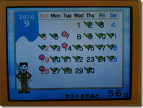

2010年の1年間をかけてTOEICの初受験から100点upを実現しました。1年で計3回受験したのですが、2回目の受験で中途半端なTOEIC対策をしたことで初受験よりも60点も下がってしまうという貴重な経験もしました。2回目から3回目では実に160点upを実現したことになります。この経験からTOEICのスコアアップのために必要なことが少々見えてきたように思っています。仕事や就職等でTOEICのスコアが必要になる人は多いと思いますので、自分の経験をまとめておき、少しでもその様な方々の役に立てればと思います。

### 初めにTOEICのスコアアップの方法

一番初めに一番重要だと思ったことを書いておきます。それは「TOEICの新公式問題集をやること、そのうえで対策を練ること。定期的にやり直して実力の向上を確認すること。」です。どのような対策を立てるにしても、自分なりの回答方法を編み出す、身に着けるにしても、なんにしても、まずは新公式問題集をやらなくては話が始まりません。逆にこれをやれば自分の実力がわかり強いところ弱いところがわかります。わかってしまえば、あとは弱いところを補強すればいいだけです。

新公式問題集を実施した結果は本当に実際のTOEICの結果と同等のスコアが出ます(でました)。さすが出題内容等よく研究されているなと思います。**本番さながらの問題を事前にできて、対策できれば、本番でいい結果が出せるなんて当たり前のことです。逆に練習でできないことが本番でできることはありません。**これはもう本当に声を大にして言いたいです。

 

いいたいことはほとんどこれだけなのですが、せっかくなのでもう少し詳細に…。

スコアの推移

- 2010年1月31日(初受験。準備まったくなし。) 675(L385, R290)
- 2010年7月25日(事前に少々TOEICのテクニックを学ぶ。) 615(L345, R270)
- 2010年11月28日(4か月程度TOEIC対策を本気で。) 775(L420, R355)

### 一年間の流れ

#### 1月の 初受験

初回の受験はなにも準備をせず、あえて悪い点数を取ったうえで2回目3回目でスコアアップを派手にやりたいという思いがあり、本当になにも準備せずに受験に臨みました。出題形式もわかっておらず、試験のイントロダクションを全部真面目に聞きながら、問題用紙と回答用紙の配置方法すら試験中に悩みながら受験をしました。

初回受験でうっかりしていて、時計を忘れてしまいました。結果、案の定問題が全然足りず、マークシートを10問以上もぬれずに終了。

結果が思ったよりもよかったので、2010年の11月受験の目標を800点に定めつつ、「時計さえあって時間をきちんと把握して受験すれば700点くらいとれたんじゃないか。」「TOEICはテクニックを学ぶと50点くらいは簡単に上がるらしいから、時計を忘れずに、受験前に1週間くらいTOEICのテクニックを勉強して、次回は700点強の点数を取ればいいだろう。」という甘い考えを持ちました。(これは結果的に大間違いだったのですが…)

#### 7月の2回目の受験

本当に特にTOEIC向けの勉強はせず、いつも通りsmart.fmをちょっとやったり、podcastを聞いたりする程度でTOEIC受験1週間前に。「さて、そろそろTOEIC向けのテクニックの勉強でもするか」ということで本でも買ってみようかととおもったのですが、自宅に昔買ったTOEICの本があったことを思い出してそれをひととおり読みました。

これはとても大きな間違いだったのですが、自宅にあった本は本当に大昔にかったものだったので、試験内容の**改定前のもの**でした。英文の間違いさがしのテクニックなどを真剣に学んだのですが、完全に検討違いでした…。

そして、「本番さながらの準備」というものはまったくしないまま、実践は伴わない頭でっかちのTOEIC対策(しかも時代遅れ)をたずさえて、時計だけは忘れずに受験。結果はまた時間内に終わらず、中途半端に「先読み」をしようとしてうまくできず…などということをくりかえしてしまい、とりあえず最後の1分くらいで残りの問題を全部塗りつぶしはしたものの、初回から60点もダウン…。少なからずショックを受けるのでした。(今思えば当たり前なんですけど…。)

#### 11月の3回目の受験

3回目の受験は2回目の反省を踏まえて、きちんと公式問題集を購入し、実際に何度も繰り返し問題を解いたうえで自分なりの時間の使い方や、問題の解き方、ペース配分等をつかみました。ある程度感覚をつかんだうえで自分の一番弱いPart5の問題集を別途購入してやりこんだり、それなりに効率的に準備できたと思います。

最後の2週間程度で追い込みをするつもりが、仕事が非常に忙しくなってしまってなんとか試験前日に睡眠時間を確保する程度しかできませんでしたが、当日も練習通りの感覚で、結果も想定通りの結果でした。800点は練習段階でも手が届いていなかったので、目標までは届かずとも、仕方がない、という感覚です。

1年間、本気を出したのは3、4か月程度で100点アップであれば効率はまぁまぁだったのではないでしょうか。

### 回答方法

1回目、2回目、3回目と回答方法は準備の差もあってまったく異なるものになりました。

1回目 --- リーディングはイントロダクションも集中して聞く。先読みは一切なし(余裕なし)。part3に至っては、1つの会話につき3問回答することを理解しておらず、ボロボロ。リーディングも全文を何度も読み直しながら回答。今思うとよく675取れたのが不思議なくらい。

2回目 --- リーディングはイントロダクション中はぼーっと。先読みをするといいらしいという知識はあったものの、それをやる余裕がなく。「先読みをやろうとしてできない→焦る→次の問題に響く」の連続コンボ。途中2問程度会話中にマークシートを自信をもって塗りつぶせるものがあり、「ああ、なるほど、こうやってやればいいのか！」という感覚をつかめることがありましたが、今にして思えば「そんなことは練習でやるものであって、本番でやることではない」という感じです…。リーディングは苦手なpart5を考えても駄目だろうからということでバンバン適当にマークシートをつけて、先に進んでリーディングに時間を回す作戦と取りましたが、それでもリーディングも終わらず。作戦は失敗。

結果を見ると、明らかに「**中途半端な反復練習を伴わないTOEIC対策の知識がむしろ邪魔をしてしまった**」ことがよくわかります。

3回目 --- 公式問題集で何度も練習をしたので、それにしたがって時間を配分。まず、part1がはじまった瞬間からpart5に取り掛かり、1問目がはじまる前に、part5の1列は終わっている状態に。また、ページをめくる際に間の時間が長いことを利用してそこで1問進める、part2は問題文を読む必要がないのでぎりぎりまでpart5を進める、というやり方で5~10分程度リーディングの時間を稼ぎました。私は練習の時からこのやり方をやらないと時間が間に合わず、これをやれば時間内に終わるようなスピードが身についてました。

part3,4はすべて先読みを実施。問題と解答を覚えていられないことがわかっているので(全部ヒアリングできたとおもっても、内容を覚えて入れれなくて正答できない)、先に問題を読んでおき、「答えが今言われた!」とおもったら、すぐに回答文のなかから正解を選び、それを指で押さえておき、3問まとめてマークシートにチェックをしする方法で統一。練習通りにやりました。

リーディングのpart5についてはまず選択肢をみて全文読むべき問題か、空白の前後だけで回答できる問題化を判断。品詞にも気を配って回答しました。part6,7に関しては残念ながら対策が行き届かず適当に実施。なんとかぎりぎりで全問に回答しました。

### 対策に使ったもの

今回私が対策に使ったものをまとめておきます。

#### TOEICテスト新公式問題集

何は無くともまず、これです。私はvol.3とvol.4を使いました。本当にTOEIC受験をしているのに、公式問題集を使ってないなんてありえない、と思ってしまうくらいです。ぜひぜひやりこむべし。

 

#### 新TOEIC TEST 総合対策 特急

新公式問題集をひととおり解いた後に、弱点部分への取り組み方を研究するために購入しました。1日でサクッと読み終わってしまいましたが、今まで断片的に知識として持っていたものが、まとまって本という形で整理されて手に入った、という感じです。本当に「TOEICのための本」ではありますがTOEIC対策としては良書だと思います。

 

#### smart.fm, PowerWords

私は単語勉強には[smart.fm](http://smart.fm/)とPowerWordsを使いました。smart.fmのPC用のサイトが一番いいと思うのですが、電車の中でできないので、電車の中用にはiPhoneアプリを購入しました。いくつかありますが、800点が目標だったので、「TOEIC800点を狙え!」をやってました。今思うと800点を狙ってしまったので、この結果であって、もうちょっと上のレベルを狙うべきだったかなとも思いますが…。

 

 [TOEIC 800点を狙え！- Smart.fm](http://click.linksynergy.com/fs-bin/click?id=bCuRGpr1MYc&offerid=94348.4357032934&type=2&subid=0)

 

PowerWordsの方はボキャブラキングでも遊びつつ、学習はPowerWordsで進めて、結局レベル7までクリアした状態までしかいけませんでした。こちらも本来8000を終えるところまでやりたかったのですが、根性と時間が足りませんでした。

[PowerWordsオンラインコース - アルク教育社](http://www.alc-education.co.jp/academic/net/pw.html)あたりを見ると、なるほど、私のTOEICの特典と実際にリンクしてます。さすがに研究されてますね。もっとやるべきでした…

 

 

 

 

 

 

 [アルク PowerWords 2000レベル](http://click.linksynergy.com/fs-bin/click?id=bCuRGpr1MYc&offerid=94348.4327779826&type=2&subid=0)  [アルク PowerWords 4000レベル](http://click.linksynergy.com/fs-bin/click?id=bCuRGpr1MYc&offerid=94348.4327873046&type=2&subid=0)  [アルク PowerWords 6000レベル](http://click.linksynergy.com/fs-bin/click?id=bCuRGpr1MYc&offerid=94348.4327881112&type=2&subid=0)  [アルク PowerWords 8000レベル](http://click.linksynergy.com/fs-bin/click?id=bCuRGpr1MYc&offerid=94348.4327890760&type=2&subid=0)  [アルク PowerWords 10000レベル](http://click.linksynergy.com/fs-bin/click?id=bCuRGpr1MYc&offerid=94348.4327892956&type=2&subid=0)  [アルク PowerWords 12000レベル](http://click.linksynergy.com/fs-bin/click?id=bCuRGpr1MYc&offerid=94348.4327894880&type=2&subid=0)

### DSソフト

公式問題集を始めるまでは、DSの英語学習ソフトを使ってました。こちらはペースメーカーとしてはかなりいけてると思います。1週間もがんばってつづければ、習慣になって、毎日スタンプを押さないと気持ちが悪くなってしまいますよ。私が使っていた英語漬けとTOEIC TEST DS トレーニングは800点を狙うには難易度的にちょっと簡単すぎる面がありましたが英語学習の習慣づけには非常に役立ったと思います。

 

 

 

### part5対策

私の一番苦手だったpart5対策は緑本を使いました。集中的に勉強できるのでpart5の学習には効果的だったと思います。

 

### やっておくべきだった事

結果的に準備に一番時間を割かなかったpart6,7が足を引っ張った形になってしまいました。私はITの仕事をしているのでコンピューターの技術系の英語であればすらすら読めるのですが、TOEICの英語は相当読みづらかったです。そして、TOEICの長文対策によく合うレベルの問題とその解法を身につけないまま、試験に臨んでしまいました。(最後の2週間くらいで集中的にやるつもりでできませんでした。)

### TOEICについて思うこと、今後

本来は目標としていた800点を取ってから「やればできるよね」と言いたかったところなのですが、目標には届きませんでした。が、それでもやはり「やればできるよね」ということを感じました。そして私はやらなかったからできなかった。私のレベルでも毎日通勤電車のなかで2時間程度の英語学習を3年程度は継続しています(去年まではTOEIC対策は皆無)。その程度ではこの程度であり、もっとやればもっといい点が取れたでしょう。

本当に語学は筋トレと一緒だと思います。

そして、「実力者はTOEICで高得点を取るが、TOEIC高得点者が必ずしも英語の実力者ではない」、「TOEICのレベルは低い」ということも身に染みてわかりました。私はまだまだですが、TOEIC向けの勉強をあと1年も頑張れば、860～900点くらいは取れると思うんです。でも、それでもやはり話せない、コミュニケーションの取れないままで達成できてしまうことは想像に難くありません。

TOEIC以外の英語の勉強をして実力をつけて、2，3年後に特別な対策をしなくても900点以上取得できるようになっていないなと思います。
