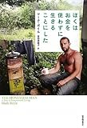

しばらく前に読みました。客先でお昼に食事をして、結構時間があったので本屋さんに入って表紙を眺めていて、目についたのがこの本。

私は金銭的な部分での不安が尽きないので(お金が無い訳では無いのですが)「お金を使わないで生きる」という事が本当にできるなら心配が払拭できるよな、と思ってどんな事をしているのか興味を持って読みました。

著者は実際に1年間の金なし生活をおくり、その様子が書かれています。山の中で全部自給自足で……というわけではなく、現代の文明の中での金なし生活、と言った感じでした。自家栽培をしたり、まだ食べられるけど破棄される食べ物を入手したり、無料で人にスキルを教えあうコミュニティがあったり。テレビ、マスコミに注目されてインタビューを多数受けたり。

完全にお金を使わない生活にしなくても、そういったコミュニティと積極的にかかわるという生き方はありだなと思いました。

でも、本の中にもでてきましたが、1人ならそれでいいかもですが、恋人がいたり、家族がいたりしたらそうはいかないのでは？という気もしました。

でもでも、お金なんか必要最小限しか使わなくても豊かな生活ができるんだという意識は強まったように思います。

[ぼくはお金を使わずに生きることにした](http://www.amazon.co.jp/exec/obidos/ASIN/4314010878/ebiswebpag-22/ref=nosim/)

posted with [amazlet](http://www.amazlet.com/browse/ASIN/4314010878/ebiswebpag-22/ref=nosim/ "ぼくはお金を使わずに生きることにした") at 12.04.25

マーク ボイル  
紀伊國屋書店  
売り上げランキング: 2113  

[Amazon.co.jp で詳細を見る](http://www.amazon.co.jp/exec/obidos/ASIN/4314010878/ebiswebpag-22/ref=nosim/)
