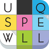
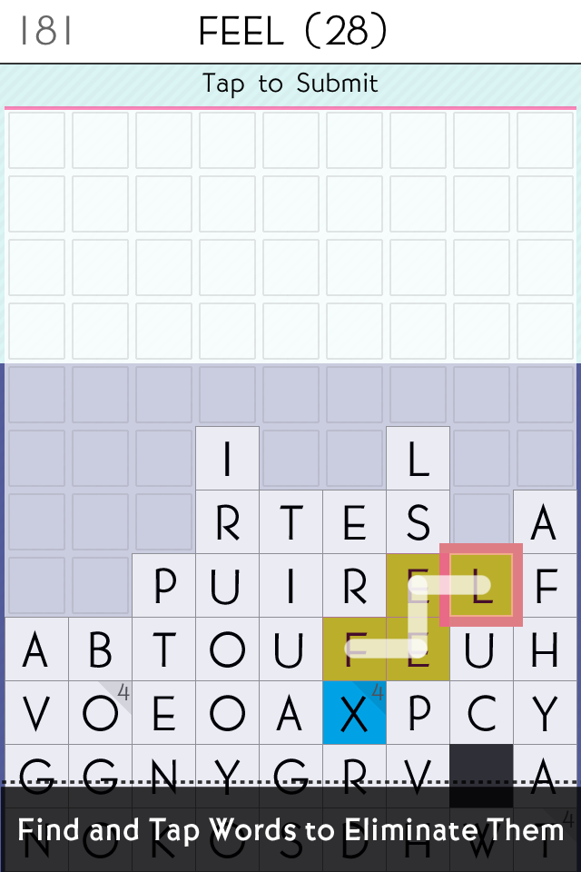
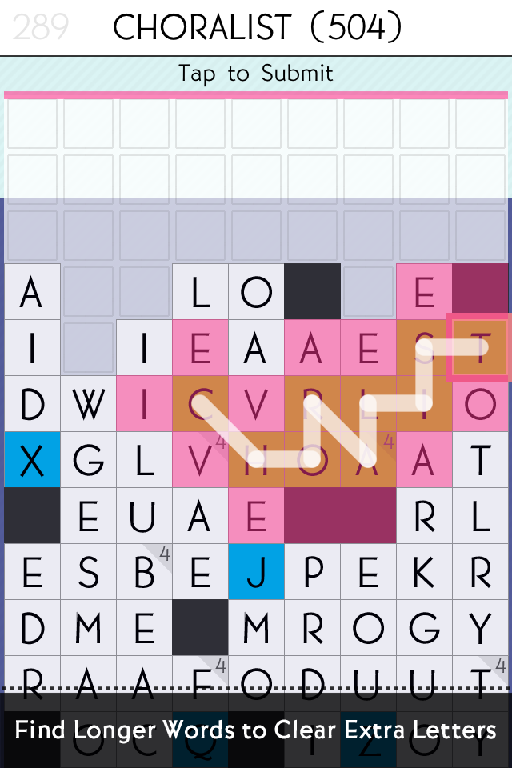

ブログを書くのがすっかり久しぶりになってしまいました。英語勉強は……毎日Podcastを通勤中に聞く程度になってしまっていました。

これではいけない！ということでなにか面白い物をやりたくて、ふと目にとまったSpellTowerを購入して遊んでみています。

## SpellTower 3.0.2（￥85）

 カテゴリ: ゲーム, 単語, パズル 現在の価格: ￥85（サイズ: 17.3 MB） 販売元: [Zach Gage - Zach Gage](http://click.linksynergy.com/fs-bin/stat?id=bCuRGpr1MYc&offerid=94348&type=3&subid=0&tmpid=2192&RD_PARM1=http%253A%252F%252Fitunes.apple.com%252Fjp%252Fartist%252Fzach-gage%252Fid294263418%253Fuo%253D4%2526partnerId%253D30) リリース日: 2011/11/17  
  iPhone/iPadの両方に対応

現在のバージョンの評価: （1件の評価） 全てのバージョンの評価: （9件の評価）

 

お気軽に購入してみましたが、これがまたなかなか難しいです。なにせ知らない単語は作れないですからね…。とおもったのですが、結構適当に単語を並べてみても言葉になる物です。自分の知らない単語ができあがってしまったら、ゲーム終了後にリストで英英辞典で意味を確認してみたりすることができます。

でも、「もうちょっと単語がでてきたらたのしいんだろうけどなー」という感じです。もしかすると英語の辞書を片手に遊ぶと良いのかもしれません。
