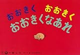

[おおきくおおきくおおきくなあれ (ひろがるせかい) (まついのりこ・かみしばいひろがるせかい)](http://www.amazon.co.jp/exec/obidos/ASIN/4494074985/ebiswebpag-22/ref=nosim/)

posted with [amazlet](http://www.amazlet.com/browse/ASIN/4494074985/ebiswebpag-22/ref=nosim/ "おおきくおおきくおおきくなあれ (ひろがるせかい) (まついのりこ・かみしばいひろがるせかい)") at 12.05.29

まつい のりこ  
童心社  
売り上げランキング: 25405  

[Amazon.co.jp で詳細を見る](http://www.amazon.co.jp/exec/obidos/ASIN/4494074985/ebiswebpag-22/ref=nosim/)

この間池袋に行ったときに上の娘と息子をつれてジュンク堂に行ってきました。そこで息子が選んだのがこの紙芝居。いままで絵本は大量に我が家にあるのですが、紙芝居は初めて購入しました。「本当に読むんかいな」と思ってましたが、どうしてこうして、息子の一番のお気に入りになりました。

子供参加型の紙芝居で一緒に「おおきくおおきくおおきくなあれ」って言うと、豚が大きくなったり、卵が大きくなって怪獣が生まれたり、ケーキが大きくなったりします。すごく楽しいみたいで、大きな声で「おおきくなあれ！」って言ってます。そして、自分でも読みたいらしく、覚えたてのひらがなを必死に読みます。暗記してる部分と、きちんと読んでいる部分が混在してて、なかなかカオスな殊になってますが、本人はいたって真面目なようです。

娘には毎日毎日絵本をいっぱい読んであげたのですが、息子にはまだまだ足りてないように思います。まだカタカナは全然読めないし。いっぱい読んであげたい…けど、上の娘と下の娘も一緒にいるのでなかなかバランスが難しいところです。
