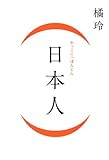

[(日本人)](http://www.amazon.co.jp/exec/obidos/ASIN/4344021762/ebiswebpag-22/ref=nosim/)

橘 玲  
幻冬舎  
売り上げランキング: 343  

[Amazon.co.jp で詳細を見る](http://www.amazon.co.jp/exec/obidos/ASIN/4344021762/ebiswebpag-22/ref=nosim/)

たしか１週間くらい前に通勤電車の中で読み終わりました。日本人が定説とは違う切り口でとらえられていました。結構説得力もあり、「だからなんだ」という所もあり。面白い部分と退屈な部分が混ぜこぜになってる印象でした。橘玲氏の書籍はどれも非常に興奮して読んだ物ばかりなので、そういう意味では今までで一番面白くなかったです。書籍の書かれている方向性と私の求める物があまりマッチしていなかったようです。
