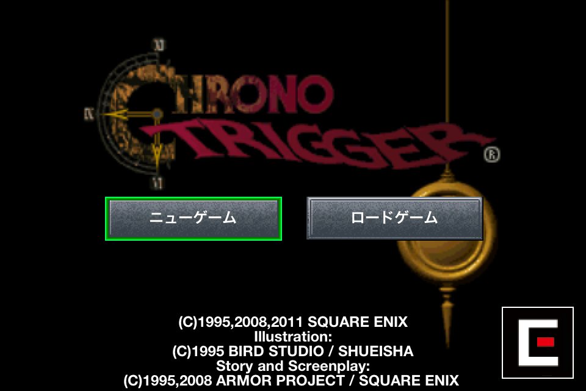

最近通勤電車内の英語勉強に若干マンネリ感が出てきてしまったので、iOS版の黒のトリガーを購入しました。

## クロノ・トリガー 1.0.1（￥1,200）

 カテゴリ: ゲーム, ロールプレイング 現在の価格: ￥1,200（サイズ: 616.2 MB） 販売元: [SQUARE ENIX - SQUARE ENIX Co., Ltd.](http://click.linksynergy.com/fs-bin/stat?id=bCuRGpr1MYc&offerid=94348&type=3&subid=0&tmpid=2192&RD_PARM1=http%253A%252F%252Fitunes.apple.com%252Fjp%252Fartist%252Fsukuu-ea-enikkusu%252Fid300186801%253Fmt%253D8%2526uo%253D4%2526partnerId%253D30) リリース日: 2011/12/09  

現在のバージョンの評価: （162件の評価） 全てのバージョンの評価: （698件の評価）

 

OSの言語設定で英語を選べば、すべて英語でゲームを楽しむ事ができちゃいます。ゲーム…なのですが、実際にやってみるとメッセージは結構難しいです。RPGなのでメッセージの意味を理解しないと進める事もそれなりに難しく、辞書アプリでわからない単語を調べつつ遊んでいます。

ところで、当時バリバリのSEGA派だった私はスーファミを持っていなかったので、このゲームやった事無いんです。でも、本当はやりたかったんですよね。10何年もしてから当時やりたかったゲームを英語の勉強もかねながら通勤電車の中でやる日が来るとは思いませんでした。面白い物です。

ところで、面白く遊んでいるのですが、操作性が悪いです。移動がやりづらいです。やっぱり十時キー前提のものをタッチで操作するのはちょっと無理がありますよね……。まぁ、そのあたりをちょっと我慢すれば、こういうレトロなゲームが好きな人にはなかなか良いんじゃないでしょうか。
