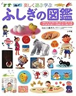
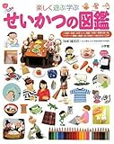
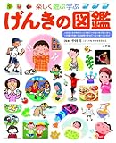

[楽しく遊ぶ学ぶ ふしぎの図鑑 (小学館の子ども図鑑プレNEO)](http://www.amazon.co.jp/exec/obidos/ASIN/4092131852/ebiswebpag-22/ref=nosim/)

posted with [amazlet](http://www.amazlet.com/browse/ASIN/4092131852/ebiswebpag-22/ref=nosim/ "楽しく遊ぶ学ぶ  ふしぎの図鑑 (小学館の子ども図鑑プレNEO)") at 12.07.01

  
小学館 (2011-02-25)  
売り上げランキング: 1449  

[Amazon.co.jp で詳細を見る](http://www.amazon.co.jp/exec/obidos/ASIN/4092131852/ebiswebpag-22/ref=nosim/)

[せいかつの図鑑 (小学館の子ども図鑑プレNEO)](http://www.amazon.co.jp/exec/obidos/ASIN/4092131844/ebiswebpag-22/ref=nosim/)

posted with [amazlet](http://www.amazlet.com/browse/ASIN/4092131844/ebiswebpag-22/ref=nosim/ "せいかつの図鑑 (小学館の子ども図鑑プレNEO)") at 12.07.01

流田 直  
小学館  
売り上げランキング: 2210  

[Amazon.co.jp で詳細を見る](http://www.amazon.co.jp/exec/obidos/ASIN/4092131844/ebiswebpag-22/ref=nosim/)

[楽しく遊ぶ学ぶ げんきの図鑑 (小学館の図鑑 プレNEO図鑑)](http://www.amazon.co.jp/exec/obidos/ASIN/4092131860/ebiswebpag-22/ref=nosim/)

posted with [amazlet](http://www.amazlet.com/browse/ASIN/4092131860/ebiswebpag-22/ref=nosim/ "楽しく遊ぶ学ぶ げんきの図鑑 (小学館の図鑑 プレNEO図鑑)") at 12.07.01

  
小学館 (2012-02-24)  
売り上げランキング: 1889  

[Amazon.co.jp で詳細を見る](http://www.amazon.co.jp/exec/obidos/ASIN/4092131860/ebiswebpag-22/ref=nosim/)

上の娘は本が好きで沢山読んでいるのですが、中でもこの図鑑シリーズは面白いらしく何度も何度も読み返しています。ふしぎの図鑑に書いてあった事を教えてくれたり、せいかつの図鑑を読みながらシューズを洗ったり、げんきの図鑑をみながら朝ごはんをつくってみたり。おとなでも知らない事が沢山書いてあるので勉強になります。というか、せいかつの図鑑とか私ほとんど知らない事ばかりで、いかに自分に一般常識がないかというのを思い知らされる次第でございます……。
