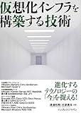

[仮想化インフラを構築する技術](http://www.amazon.co.jp/exec/obidos/ASIN/484433218X/ebiswebpag-22/ref=nosim/)

posted with [amazlet](http://www.amazlet.com/browse/ASIN/484433218X/ebiswebpag-22/ref=nosim/ "仮想化インフラを構築する技術") at 12.08.06

渡邉 利和 川添 貴生  
インプレスジャパン  
売り上げランキング: 94559  

[Amazon.co.jp で詳細を見る](http://www.amazon.co.jp/exec/obidos/ASIN/484433218X/ebiswebpag-22/ref=nosim/)

主に飛行機の中で読みました。ずっと仮想化インフラ周りはトレンドを追ってすらいなかったので概要を短時間で把握するにはなかなかよかったです。踏み込んだ内容は皆無ですが、それはそもそもそういう本なので。お客さんはこういう本をこういうレベルで読んでるのかなーという気がしました。
