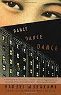
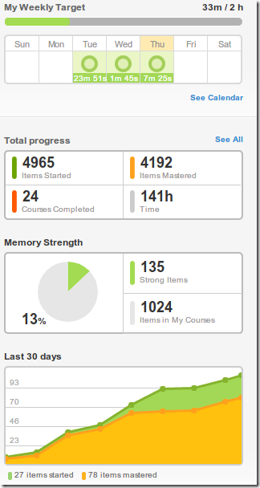

このブログにエントリを書くのは久しぶりになってしまいました。英語学習は細々と続けております。

メイントピックは今週末にある英検準1級の試験!!……のはずなのですが、全然気合い入らないです。TOEICの時はなんだかんだで頑張って勉強したんですけど、今回は別に落ちていいやーって感じになってしまっております。どうしたんでしょうね?

TOEICだとまがりなりにも点数が出るので、「今のスコアはこれ」という結果が出るのですが、英検だと合格か、不合格か…だからかなぁ…という気がしています。TOEICのスコア的には合格圏のはずなのですが、過去問を一度解いてみた感じだと全然合格する気がしないです…。

主に単語がわからないです。でも、それにしたって難しくない?という単語レベルに思えるのですけどね……。一応英検準1級用の単語アプリを購入して、それをiKnow!に登録して学習してたりしますが、全然追いつきません…。

というわけで、不合格でも別にいいかな…という気持ちになっております…。

やっぱり試験勉強になってしまうと面白くないですね。そんな中で、最近は洋書を読み始めました。10年前くらいに社員旅行で行ったハワイで買った「DANCE DANCE DANCE」。

[Dance Dance Dance (Vintage International)](http://www.amazon.co.jp/exec/obidos/ASIN/0679753796/ebiswebpag-22/ref=nosim/)

posted with [amazlet](http://www.amazlet.com/browse/ASIN/0679753796/ebiswebpag-22/ref=nosim/ "Dance Dance Dance (Vintage International)") at 12.10.11

Haruki Murakami  
Vintage (1995-01-31)  
売り上げランキング: 59132  

[Amazon.co.jp で詳細を見る](http://www.amazon.co.jp/exec/obidos/ASIN/0679753796/ebiswebpag-22/ref=nosim/)

ちょっと読んでみたけど全然読めなくてずっと本棚に置いてあったのですが、先日ふと手に取って読んでみたら結構読めたので読み進めてみています。単語はわからないものが多いですが調べない方向で。原書は何度も読み返しているのでストーリーはそもそも知っており、それなりに楽しく読んでます。

試験を申し込んで自分を追い込む方法も、最近の私には効果がないようです…。

まぁ、一応iKnow!と通勤中のヒアリングは続いてますのであまり悲観的にならずにいこうかなと…。

