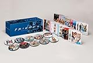

(ちゃんと勉強しなかったし、不合格だったけど)英検も終わったので、自分の楽しめる英語学習スタイルに戻しています。とりあえずみてて楽しいフレンズを字幕無しで見てます。シーズンも10まであるし、しばらくは楽しめます……。

【初回限定生産】フレンズ コンプリートDVD BOX

posted with [amazlet](http://www.amazlet.com/browse/ASIN/B008R6E1J0/ebiswebpag-22/ref=nosim/ "【初回限定生産】フレンズ <シーズン1-10>コンプリートDVD BOX") at 12.10.16

ワーナー・ホーム・ビデオ (2012-11-14) 売り上げランキング: 2611

Amazon.co.jp で詳細を見る

ちょっと難易度的に難しすぎて半分くらいしか聞き取れないのですが、ところどころちゃんと英語を聞き取って意味も分かって笑えるようになってきたのがうれしかったりします。
