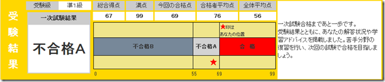
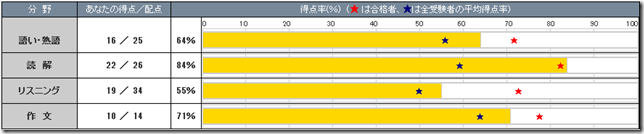

英検準1級の結果がWebから見られるようになってました。結果は合格点に2点足りず不合格でした。残念。リスニングであと2点は取れてよかったと思う…。もっともリーディングが勘でかなりあたってしまったので実力は足りていないのですが。

リスニングのできなさっぷりが…。作文はかなり適当に書いたのに10点もらえてました。採点は相当甘いようですね。

実は英検の2次試験の日は幼稚園のバザーの日だったらしく、仮に合格していても受験できない状況だったことに先日気が付きました。予定はきちんと確認しておかないとダメですね…。
