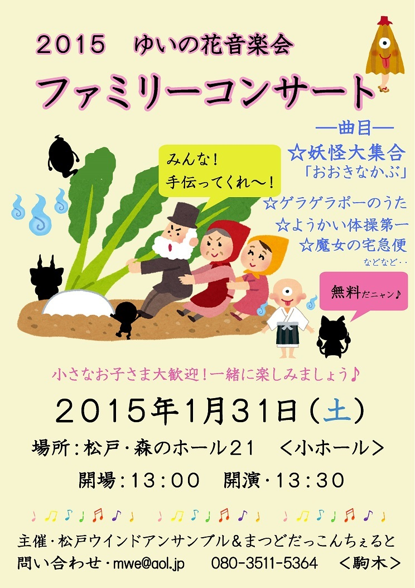

今日は、嫁さんがさんかしている(ほぼ)ママさんブラスバンドの練習に行ってきました。お誘いを頂いたので1曲だけエレキベースでの参加です。中学、高校時代にバンドを、大学時代にリコーダーサークルをやっておりましたが、大学卒業後、家での演奏を除けば誰かと一緒に合奏するというのははじめてのことだと思います。仕事がクソ忙しくてまともに練習時間も取れず、楽譜を読むのにすら苦労しながら、ちょっと手元を見ると楽譜上でどこをやってるのかわからなくなったりしながら、下の子供2人が邪魔してくるのに苦労しながらでしたが、結構楽しくやれました。やっぱり音楽っていいなぁと思います。

それにしても、弦楽器で同じ音を出すのに複数の方法があるのって難しいですね。中高時代はTAB譜で場所まで指定されていたのでそれを全部覚えてやってましたが、楽譜だけ渡されるとそれを弾く方法にかなりのバリエーションがあり、練習不足もあって自分の中でどこでどのポジションで演奏するのか定まっておらず、やるたびにアタフタしながらやってます。これを繰り返してると、アドリブに強くなりそうだなとも思いながら、昔は完全にコピーばっかりしてたものなぁと思ったりします。そもそも、きちんと何か勉強することも、学習することもなく、バンドスコアのTAB譜だけをみて全部自己流でやってましたので…。今はちょっと検索すればYoutubeでプロの演奏も見放題だし、トレーニング的な動画も沢山あるし、本当にいい時代になりましたね。

そうそう、これをやるのに昔、友人から安く譲ってもらったベースを引っ張り出してきたのですが、やはり練習にもアンプがいるよね、ということで、楽器屋さんに行って、適当に店員さんに相談して1万円くらいのアンプとシールドとストラップを買ってきました。昔は近くに楽器屋さんも少なく、お金も持ってなかったから全然買えなかったけど、大人になると欲しいものはさくっと買えちゃいますね。そういう買いたいものって嫁さんがいい顔をしないので全然好きに買えないのですが、今回は嫁さん経由の話なので嫁さんも嫌な顔ひとつせず買わせてくれました。幸せ。

と、いうわけで、私も以下のイベントに演奏者としてちょこっとだけ出ることになりました。お暇な方は聞きに来てもらえると嬉しいです。

夫婦2人で演奏していて子供たちが大丈夫なのか心配ですが(笑)、まぁ、なんとかなりますかね。
