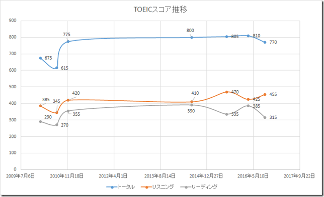

先日会社でうけたTOEIC IPテストの結果が返ってきました。試験はいつもよりも「できた」気がしたのですが、スコアは下がってリスニング455、リーディング315の合計770となりました。

 

 

推移は以下のようになってます。

 

リーディングスコアが顕著に下がってますね。

リーティングの試験の中で「感覚」で解いてる部分が相当あるのでそこの勘があたるか外れるかでスコアが上下してるけど、実力は変わっていない感じなのでしょうね。

 

IT系の英語記事は現在の語彙力、文法力の中で全く問題なく読めてしまうので、これ以上は、今の仕事の範囲でやってるだけではリーディング力は伸びないでしょうねぇ…。

 

もうちょっと日常から英語のリーディング力が足りないと感じる状況におかないとダメそうな感じになってきましたね。

 

でも、力不足を感じてるのは日常のなかで英語のみのミーティングがあるなかでの会話力なんですよね。中々うまくいかないもんです。ちょっとどこかで短期的に集中してリーディング力を上げる取り組みをしたい…。
