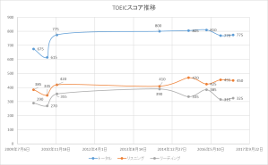
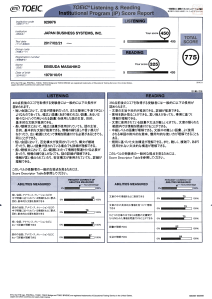

先日受けたTOEIC IPテストの結果が戻ってきました。L450, R325のトータル775でした。まともに寝ないで受けたけど、スコアとしては今までと対して変わらずでした。

今までの推移はこちら。

 

今回の結果。

 

 

いやー。こうしてみると10年間くらい全く進歩してないですね。リスニングがちょっと上がって、リーディングがちょっと下がってる感じですか。現状維持してる、という見方もできるかもしれませんが、一番英語力があった時期にTOEICを受験してないかもしれないので、緩やかに英語力が衰退してるかも・・・。

仕事で英語を使う機会は以前より遥かに多くなってるので(最近飲み会は英語の方が日本語より多い)、もっとスコアもあげたいし、実力も上げたいです。

いやー。なにかブレイクスルーが必要ですね。勉強時間はそもそも取れないので、やっぱりもっと英語で仕事をすることに時間を使える状況を作るのでしょうな…。
