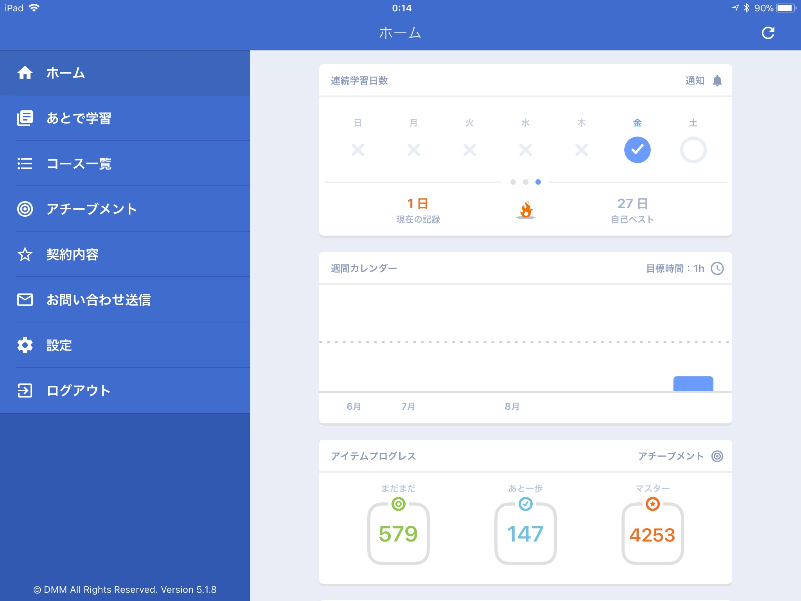

このブログにはものすごく久しぶりの投稿となりました。

すっかり「英語学習！」はしなくなっておりますが、日常の中で英語を使う機会はそれなりに継続的にずっとあったのですこーしづつ英語力は上がっているのでは？と個人的には考えています。でもやはり単語力や文法力は全然上がっていないと思います。

それでもそこまで不便を感じなくなったので同じレベルで推移していましたが、長女が中学生になり、英語を勉強しだしているなかで、毎日の英語学習の習慣づけをして欲しいのですができておらず。ここはやはりやれやれいうだけじゃなくてお手本をみせないとなぁと思って長女にも契約してつかわせているiKnow!を私も再開することにしました。学習時間とか継続日数とか、マスターした単語数とか数値ででるので「やってるよ」というのがわかりやすいですし、結局私の英語力向上にはiKnow!が一番貢献してくれたと思うので、思い切ってライフタイムプランで契約しました。

ライフタイムプランは24800円で一生サービス使いたい放題という思い切ったプランです。いつまでサービス継続してくれるのか？という話もありますが…まぁそこはお布施だと思って。どんなに短くてもいいから毎日継続しようと思います。まぁ1日10分で1週間70分くらいくらいの低い目標から始めて習慣化したいとおもいます。

現在は上記のような状況。ここから再開します。
