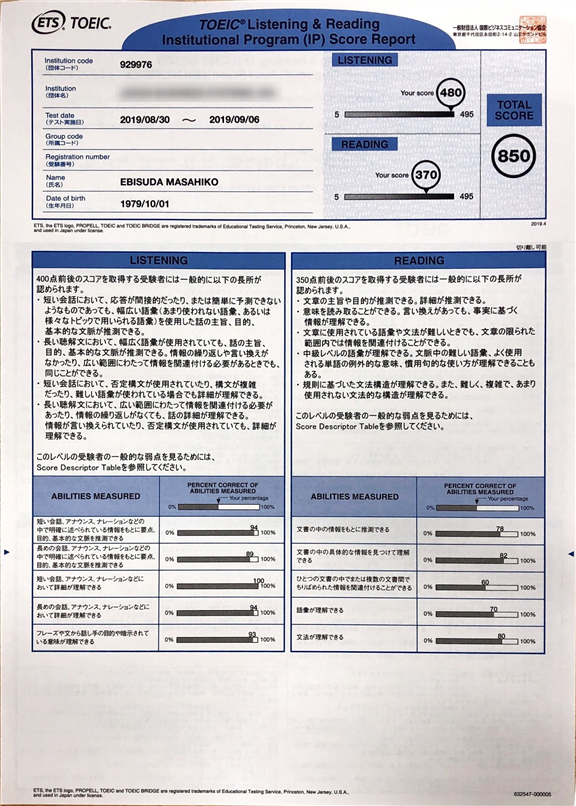
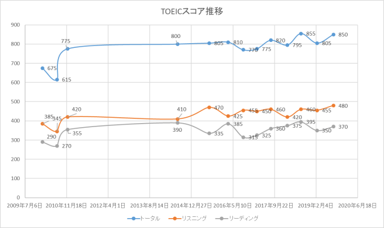

会社で受けたTOEIC IPテストのスコアが返ってきました。結果は850(L480, R370)でした。最高スコア更新はならず…、でもリスニングだけ見ると過去最高得点でした。

はっきりいって、最近「英語勉強」はほぼしていないので、スコアもっと落ちてるかな？と思いながら試験を受けたのですが、受けた直後の感想としてはリスニングに関しては過去一番できた感じはしました。結果にもでてました。

自己分析では、これは多分「英語を聞きながら読む」ということを前よりもできるようになったからだと思います。最近仕事で英語を聞きながら内職することが増えたのでその成果だと思います(＾＾；

プレゼンにしても何にしても、聞くことに集中すると読めないし、読むことに集中しちゃうと聞けない…という状態が長かったのですが、やっと英語でも聞きながら、読みながら、考えながら…と複数の動作を同時にできるようになってきた気が少しします。

リーディングは相変わらずですね…。自分の仕事の範囲であれば読むのも書くのもほぼ苦労を感じなくなってしまっているので、これ以上仕事してるだけでは伸びないだろうと思っています。知らない単語いっぱいTOEICだと出てきますし…。

リーディングとリスニングの得点差がかなり激しい感じになってしまっていますが、リーディングの得点を伸ばすための努力をするかどうか…、仕事で困っていないのでこのままだとちょっと努力しない感じですね。

仕事でもうちょっと幅広い英語を扱うべき場面を増やすべきなのかも…。
