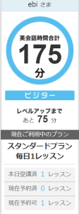

DMM英会話をはじめました。なぜ始めたのかというと会社が希望者を対象に3分の2の料金を持ってくれる事になりコスパが非常に良いからです。1日1レッスン(25分)のプランで、とりあえず7回ほどやってみたところです。

とりあえず毎日30分程度の時間を確保する必要があるので、その時間確保がまずハードルになりますが、今は昼休みに会社の会議室をつかってやってます。休日の方が時間確保大変なので…、休日は場合によってはお休みでいいかな、とも思ってます。

レッスンはオリジナル教材やフリートーク等、一通り試そうかな？という感じですが、結構普通に勉強になる感じです。特にWebのシステムがよくできていて、先生と生徒で見ている教材も同期するし、ポインターでハイライトしたところも伝わるし、SkypeではなくWeb組み込みの会話システムだし…とシステムにもかなり感心してます。

そしてやっぱりフリートークで自分の得意なIT系の話題をするのはスムーズに苦労なくできるのですが、IT系以外の話をしようとすると全然うまく話ができなくて残念な感じです。

普段の仕事でふれる英語には苦手意識はもうほぼ無いので、せっかくなので毎日の25分は得意なIT系の話はなるべく封印してとりくんでみようかなと考え中です。
