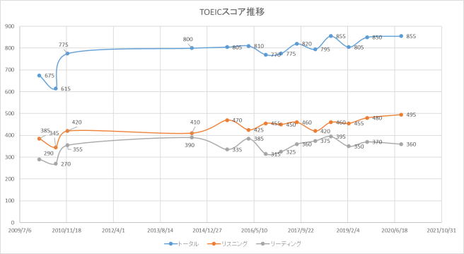

ずいぶん久しぶりの投稿になりました。先日TOEIC® Listening & Reading IPテスト（オンライン）を受けました。自宅で1時間で好きな時間に受験できました。時間が短くて大変快適でした。

そして、オンラインで受けたという要因もあるとは思うのですが、今回のスコアは855(L495, R360)ということで、リスニングに関しては満点を取ることができました。リスニングに関しては以前から「もうちょっとで満点とれそう」という感覚がありましたし、「聞きながら読む」ことにずいぶん慣れてきたのでその成果が出たと思います。

まぁ、TOEICのリスニング問題はやっぱりたいして難しいわけではないので、元気なときに短い時間で集中してできるならそりゃそうかなという気はします。

しかし、それにしても、リスニングに比較して、リーディングのできなさっぷりは相変わらずすぎて我ながら…。これまでのスコア推移は下記。

これまでリスニングのスコア向上で全体をカバーしていた感がありますが、いよいよリーディングのスコアを上げるよりほかに方法がなくなりました。仕事で触れるコンピューター系のリーディングは全く問題ないので、結局もう今の生活をしているだけではこれ以上スコアは上がりませんね。もうちょっと違うジャンルの英語を読む習慣をつけないといけません…。

だれかTOEICリーディング対策でお勧めのアプリなり、本なり、サイトなりありましたら教えてください…。とりあえず POLYGLOTS で1日1記事くらい読み続けましょうかねぇ…。
