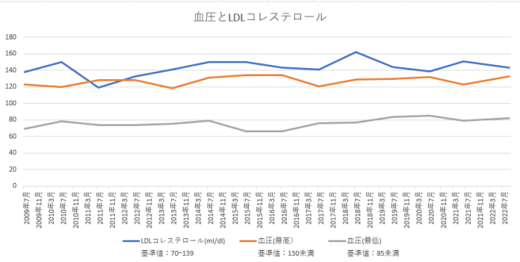

すっかりこの日記は子育て日記から私の健康日記になってしまいましたね。残念。悲しい。

先日の健康診断の結果が返ってきました。なんと心電図の所に「QT延長」という見慣れない謎の言葉が。判定もC。再検査ではなくて経過観察なのですぐにどういうという話ではないようでしたが、「QT延長」としか書かれておらずどの程度の話なのかもわかりません。ちょっとググるとQT延長症候群というものも出てくるし、悪くなると死に至るような話のようです。

心電図に関しては6月に入院してしまった時に数日つけっぱなしで計測したこともあり、それでも何も異常が無かったから全然心配してなかったのですが。

一応こういうことがあると医者に行って話をすると落ち着くタイプなので、今日近所の循環器内科に行ってきました。

結果は特に異状なし。食事も水も取らない中で午後の健康診断だったし、ちょっといつもと違う感じだったのかな？とにかく、今日は全く異常無しでしたし、前回の入院やその後たまに飲んでいる薬あたりも問題無いようなので一安心という事にしたいと思います。

で、あたらめて健康診断の結果を見ていたら、LDLコレステロールの値も異常値であることを改めて認識しました。この日記にも以前LDLコレステロールの事を書いてあったりその対策として運動したり納豆食べたり、その結果150から119まで改善したということも記録してありました。

- [健康診断でC判定, 今日のつぶやき : 9回 – ebi’s diary – インフラエンジニアの子育てなどの日記(2010-07-23)](http://ebi.dyndns.biz/diary/20100723.html)

- [LDLコレステロールを下げようと(若干)がんばってます。, 今日のつぶやき : 16回 – ebi’s diary – インフラエンジニアの子育てなどの日記(2010-08-09)](http://ebi.dyndns.biz/diary/20100809.html)

- [体力がついてきました。, 納豆を毎日食べてみてます。, 今日のつぶやき : 8回 – ebi’s diary – インフラエンジニアの子育てなどの日記(2010-08-18)](http://ebi.dyndns.biz/diary/20100818.html)

- [2013年6月の健康診断の結果/LDLコレステロール高い(141) | えび日記](https://diary.ebisuda.net/2013/06/26/3182/)

でも、その後そういえばどうだったんだっけかな…と思って改めて健康診断の値を見返してみたら…2018年には162まで上がってました…！なんか私忘れてましたね・・。一度生活と食生活を見直したらがつんと下がったから「やれば下がる」くらいに思って油断し続けていた気がします…。

グラフにしてみると以下のような感じ。

もう10年以上ずっと基準値より高いって感じですね…。情けない…。

血圧はもう毎日簡単に計測および記録できる機械も入手して管理できる気がしているのですが、LDLコレステロールは計測がなかなかできないのでちょっと良くないですね～。

とりあえず以前と同じように、納豆食べたり、卵さけたり、なるべく魚を食べたりしつつ、そろそろ運動の量を増やしてみようと思います。入院してからは運動も控えていたのですが、最近は夜もよく寝られるし、そろそろ運動して大丈夫そうですので。

- 食生活を見直す(肉少な目、魚多め、納豆多め)

- お酒は特別な日だけ

- 毎日軽く運動する

こんな生活を続けようと思います。応援いただけると嬉しいです！
